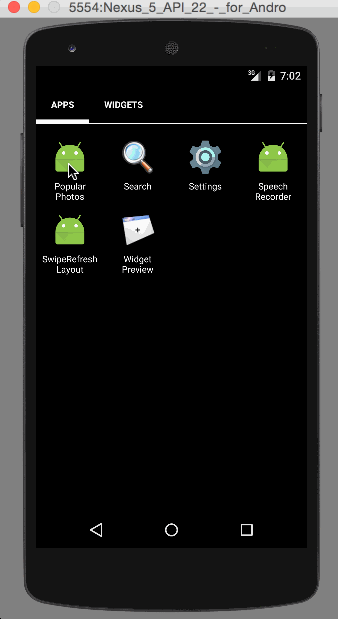

# Android Training Week1 - Android-Week1-InstagramClient
SimpleTodo is an android app that allows building a todo list and basic todo items management functionality including adding new items, editing and deleting an existing item.

Submitted by: legochen

Time spent: 4 hours spent in total

## User Stories

The following user stories must be completed:

User can scroll through current popular photos from Instagram
For each photo displayed, user can see the following details:
Graphic, Caption, Username

(Optional) relative timestamp, like count, user profile imagesThe following advanced user stories are optional:
* [] Advanced: Add pull-to-refresh for popular stream with SwipeRefreshLayout
* [] Advanced: Show latest comment for each photo (bonus: show last 2 comments)
* [] Advanced: Display each photo with the same style and proportions as the real Instagram (see screens below)
* [] Advanced: Display each user profile image using a RoundedImageView
* [] Advanced: Display a nice default placeholder graphic for each image during loading (read more about Picasso)
* [] Advanced: Improve the user interface through styling and coloring
* [] Bonus: Allow user to view all comments for an image within a separate activity or dialog fragment
* [] Bonus: Allow video posts to be played in full-screen using the VideoView

### Walkthough

